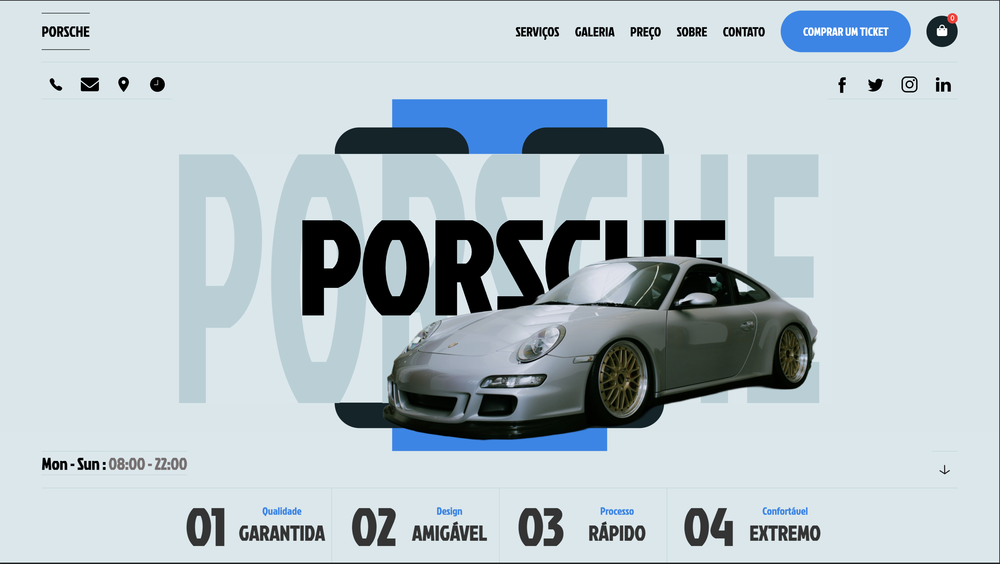

# Site Porsche -- Divulgação

---

## Sobre

Site feito para treino de figma para códigos utilizando um layout já feito, foi realizado durante o curso de desenvolvimento de sistemas do [SENAI JANDIRA](https://sp.senai.br/unidade/jandira)

---

## Tecnologias utilizadas
- HTML
- CSS
- MARKDOWN
- GIT

## Autor

- [Israel Junior](https://www.linkedin.com/in/israel-junior-0a48742b0/)